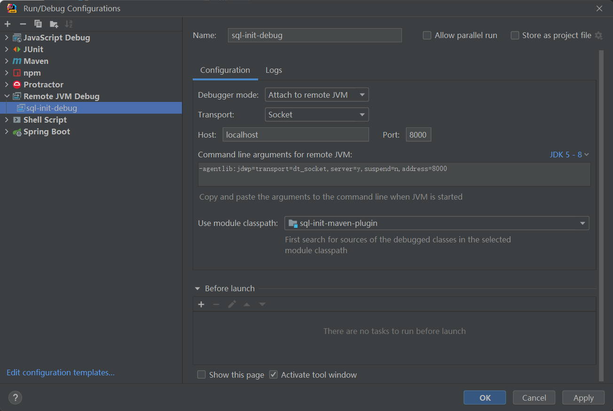

## 前言

想要一个可以自动执行 初始化数据库脚本的插件，可以避免环境或人员带来的影响。


## 引入 `plugin`

```xml

<plugin>
    <groupId>com.gt.boot</groupId>
    <artifactId>sql-init-maven-plugin</artifactId>
    <version>${gt-base.version}</version>
    <configuration>
        <sqlFile>${project.basedir}/src/http/sql.sql</sqlFile>
        <!-- 脚本文件的编码 -->
        <sqlFileEncoding>UTF-8</sqlFileEncoding>
        <!-- 数据源配置，( **必配** ) -->
        <dataSource>
            <!-- driverClassName 是要传入的值 -->
            <driverClassName>com.mysql.cj.jdbc.Driver</driverClassName>
            <url>jdbc:mysql://xxxx:3306/xxxx?charset=utf8mb4&amp;useUnicode=true&amp;useSSL=false</url>
            <username>xxxx</username>
            <password>xxx..</password>
        </dataSource>
    </configuration>
    <dependencies>
        <dependency>
            <groupId>mysql</groupId>
            <artifactId>mysql-connector-java</artifactId>
            <version>${mysql.version}</version>
        </dependency>
    </dependencies>
</plugin>
```

> 注意：SQL脚本

## Maven 插件啊

### Mojo 工程

Mojo 就是 Maven plain Old Java Object。每一个 Mojo 就是 Maven 中的一个执行目标（executable goal），而插件则是对单个或多个相关的 Mojo 做统一分发。一个 Mojo
包含一个简单的 Java 类。插件中多个类似 Mojo 的通用之处可以使用抽象父类来封装。

#### 创建

##### 1. 创建一个 Maven 项目

##### 2. 添加依赖

 ```xml

<dependency>
    <groupId>org.apache.maven</groupId>
    <artifactId>maven-plugin-api</artifactId>
    <version>3.8.1</version>
</dependency>
 ```

##### 3. 设置打包方式

 ```xml
<!--设置打包方式-->
<packaging>maven-plugin</packaging>
 ```

##### 4. 创建一个集成 `AbstractMojo` 的类

创建一个 [`MyMojo`](#AbstractMojo) 类，集成 `AbstractMojo`，其中 execute() 方法就是需要自定义实现的业务。

Mojo 标记方法，需要 @Mojo注解或Javadoc包里含@goal 注解的类来当做一个 Mojo 类。

使用 @Mojo 需要引入

```xml

<dependency>
    <groupId>org.apache.maven.plugin-tools</groupId>
    <artifactId>maven-plugin-annotations</artifactId>
    <version>3.6.2</version>
</dependency>
```


### 调试

#### IDEA 直接调试

创建一个自定义的Mojo 类 [`InitTableMojo.java`](#InitTableMojo.java)

命令行启动

```shell
mvnDebug com.gt.boot:sql-init-maven-plugin:1.0.0-SNAPSHOT:touch
mvnDebug com.gt.boot:sql-init-maven-plugin:1.0.0-SNAPSHOT:initTable
```

然后使用 `Remote JVM Debug` 连接，运行后就可以 Debug 调试代码了。



